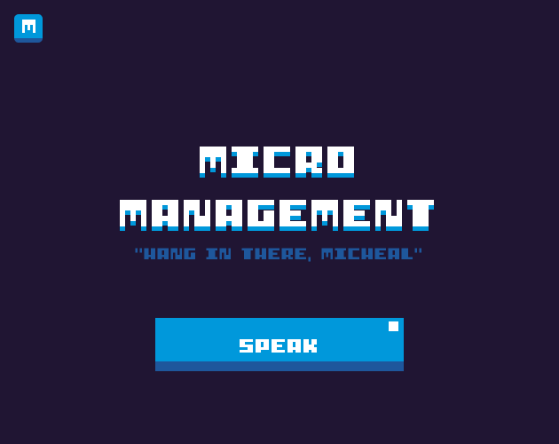

# Micro Management - v1.0

### Introduction
Micro Management is an exciting game developed for the AI Game Jam, where you take on the role of a manager responsible for guiding an individual named Michael to fix electrical boxes placed around the map. The game leverages Speech-to-Text technology to capture verbal commands from the player and utilizes OpenAI's powerful GPT model to interpret and execute those commands for Michael.

### Gameplay
Your objective in Micro Management is to efficiently direct Michael to repair the electrical boxes within the allotted time. Each electrical box has a unique set of issues that need to be addressed, and it is your responsibility to provide Michael with clear and specific instructions to fix them. However, be aware that Michael's behavior can be influenced by random elements, so your commands may not always result in the desired outcomes.

### How to Play
Submitted for AI Game Jam (2023) [itch.io](https://metaphile.itch.io/micro-management)

1. Start the game and ensure your microphone is enabled for Speech-to-Text input.
2. Speak your commands to direct Michael. It's essential to be precise and specific in your instructions.
3. Michael will carry out the tasks based on your input. Be prepared for unexpected behavior due to randomness.
4. Time is limited, so manage your commands effectively to complete the repairs within the given timeframe.
5. Successfully fix all the electrical boxes to complete the game and achieve a high score.

### Tips for Success
Use concise and explicit commands to ensure Michael understands your instructions accurately.
Adapt your strategy to unexpected behavior, as Michael's actions may not always align with your expectations.
Prioritize the repairs based on the severity of the electrical box issues.
Manage your time effectively to maximize your chances of completing all repairs.

### Dependencies
- Speech-to-Text technology to capture player commands verbally. (Whisper)
- OpenAI's GPT model to interpret and execute player commands.
- Supporting libraries and frameworks for game development (details provided in the project's documentation). (PyGame)

### Credits
Micro Management was created by MetaPhile (Abhishta Gatya) for the AI Game Jam. The game concept, design, and implementation were completed within the time constraints of the game jam. Support me at (https://github.com/abhishtagatya)

### Disclaimer
Micro Management is a prototype game created for the AI Game Jam and may contain bugs or limitations. The game's performance and behavior may not be representative of a fully polished and finalized product.

> Enjoy the game and have fun managing Michael's electrical repairs! <3
